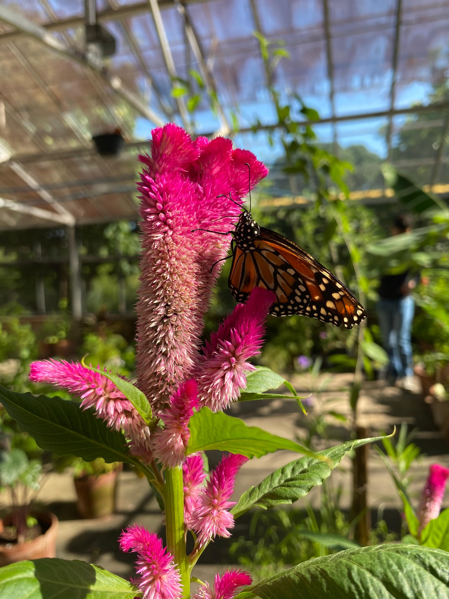
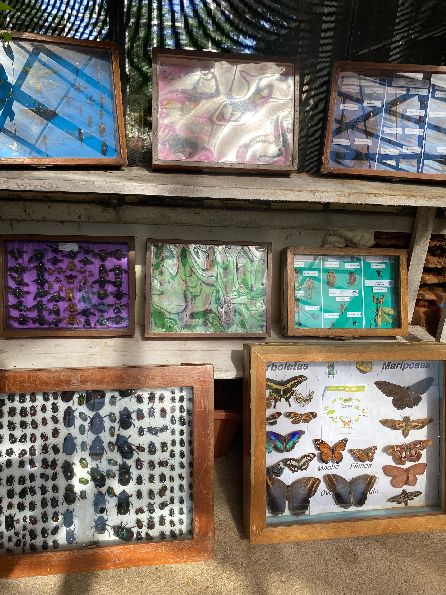
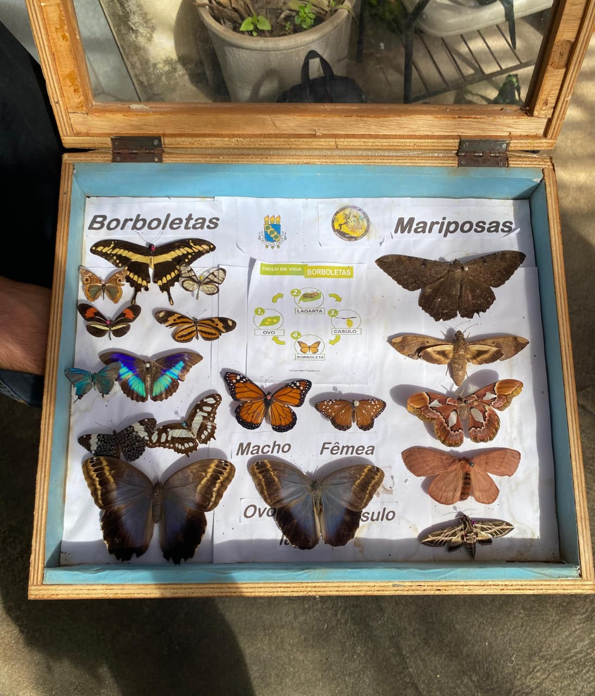
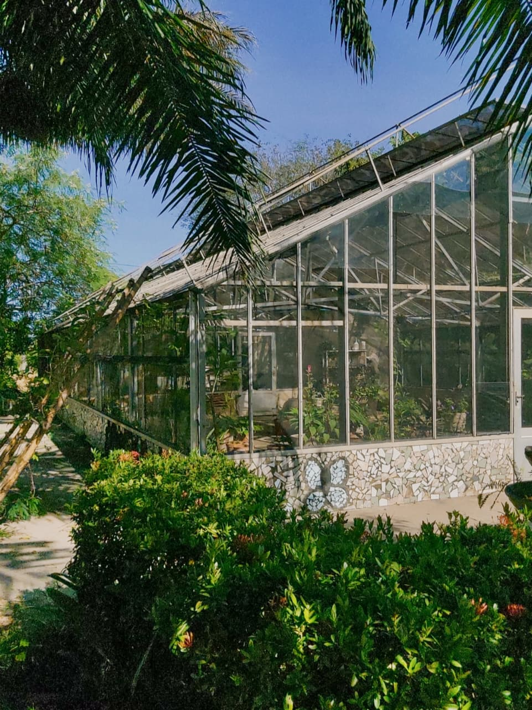
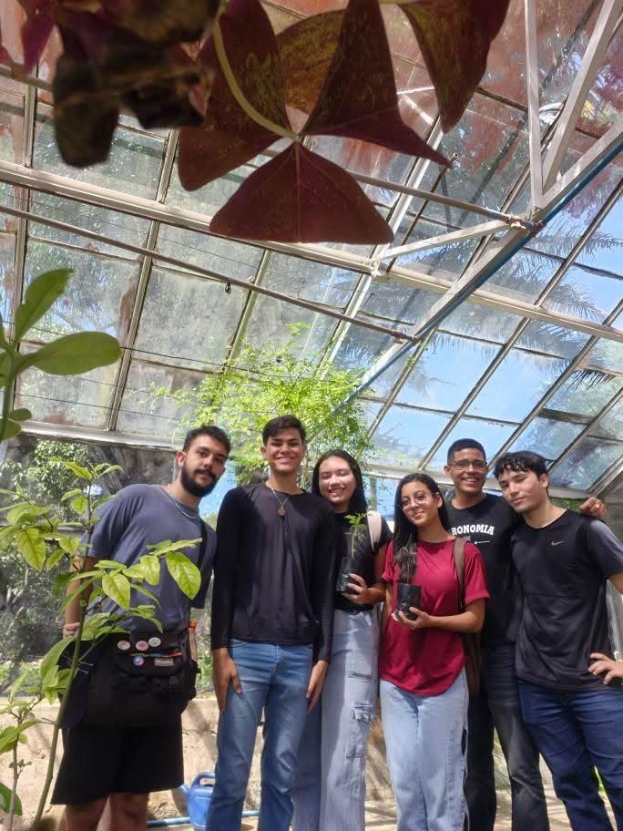

## Equipe

[Larissa Maciel](mailto:larissamaciel1e@gmail.com), [Patrícia Songo](mailto:patriciasongo@alu.ufc.br) e [Sandy Almir](mailto:sandyalmir904@gmail.com).

Nossa equipe se interessou pelos seguintes temas:
- Cibercultura
- Entomofauna
- Big Data
- Dados Interligados
  
## 10 vezes que a Internet mudou o mundo

O tema do primeiro produto de divulgação científica é *Cibercultura*. Neste vídeo,
apresentamos 10 momentos marcantes em que a Internet transformou a sociedade —
desde a forma como nos comunicamos até como consumimos informação e cultura.



## Borboletário da UFC: Um Laboratório Vivo da Natureza
O segundo produto foi um episódio de podcast no tema de *Entomofauna*. Neste
episódio, realizamos uma visita guiada ao [Borboletário](borboletarioufc21@gmail.com) da
Universidade Federal do Ceará, no Campus do Pici, explorando o ciclo de vida das
borboletas, as atividades desenvolvidas pelos bolsistas voluntários e a importância do
projeto para a pesquisa, a extensão e a conscientização ambiental. Também conversamos
com o pesquisador[Jaderson Jales](jader.aracno@alu.ufc.br), autor do artigo
“[Levantamento Preliminar da Entomofauna, em Período Chuvoso, em Área de Borda da ARIE Matinha do Pici](https://ojs.focopublicacoes.com.br/foco/article/view/1606/1125)”, que
compartilhou suas descobertas e a conexão entre entomologia e biodiversidade local.

[Ouça o episódio no Soundcloud](https://soundcloud.com/equipe08/divulgaufc-borboletario-da-ufc-um-laboratorio-vivo-da-natureza)



[transcrição_podcast.txt](transcricao_podcast.txt)

Borboleta Monarca

Mostruário de Insetos, Borboletas e Mariposas

Estufa do Borboletário

Nós e os Voluntários do Borboletário

